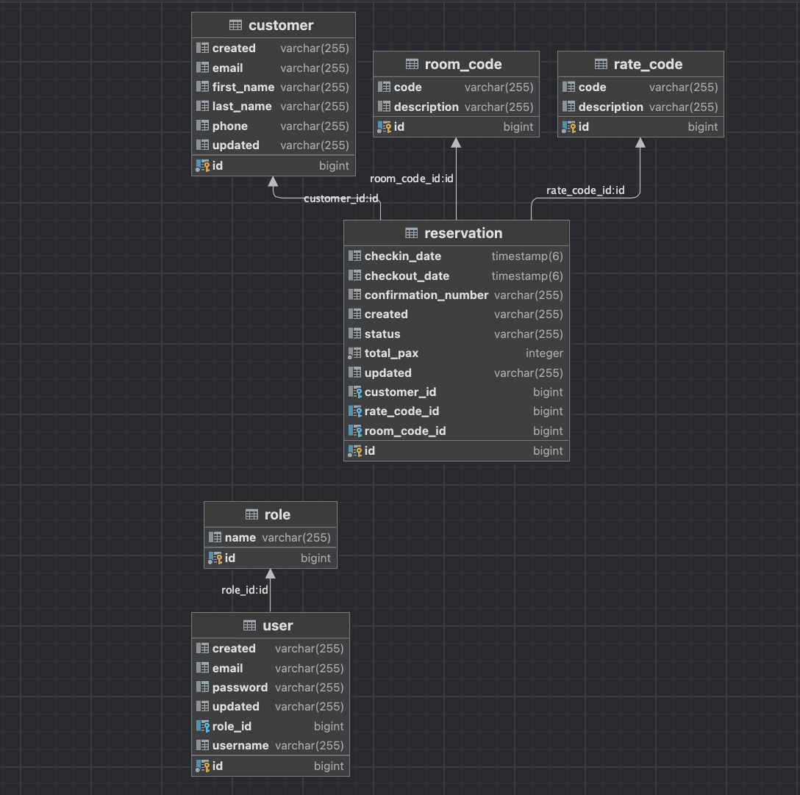
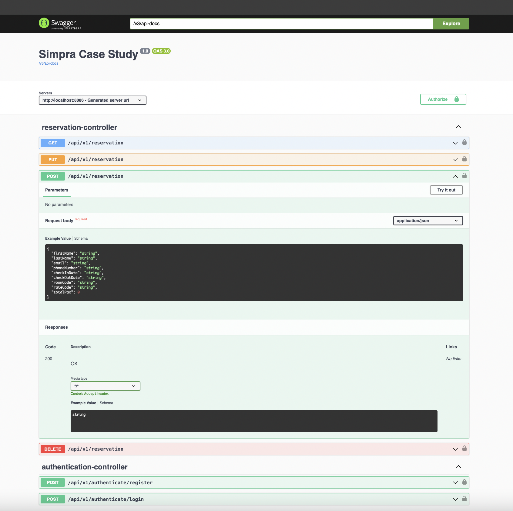
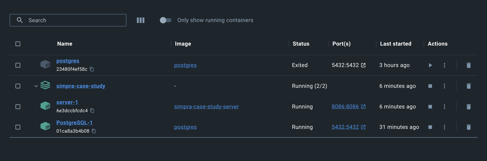
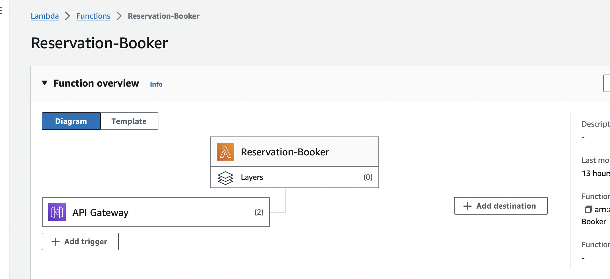
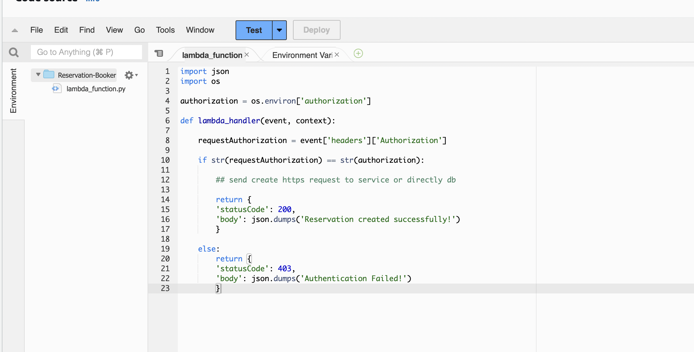

# SIMPRA CASE STUDY

## Used Technologies & Architecture & Methods:

* Monolithic Architecture
* Java 17
* Spring Boot 3.2.1
* Spring Security
* Postgres
* JSON Web Token
* Swagger 
* Maven
* Docker
* AWS Lambda Function
* Rest Client for Lambda Function call
* Java Mail Sender
* Logger

## DATABASE SCHEMA:

Created 6 entity for this case study.

Customer: Reservation owners. A user can have multiple reservations.

Reservation: Reservation details. Contains checkin and checkout dates, room number, customer id.

Room: Room Type

Rate: Rate Type

User: System Users

Role: System Roles





## SWAGGER

Swagger Implementation for API Documentation

``` 
    http://localhost:8086/swagger-ui/index.html#/
 
 ```

For JSON format:

```
    http://localhost:8086/v3/api-docs
    
```




## Docker

Docker Compose file contains 2 services. One for Postgres and the other one for Spring Boot Application.

Run the services using Docker Compose command:

     docker-compose up  



## AWS Lambda Function

Created Lambda Function with Python in my AWS account. 
It triggers by API Gateway when successfully reservation created.
Function check the authorization header and if it is valid, it returns a message.
It needed to call database or another service, using Python Request library or database connectors.

#### Lambda Function Type: Api
#### Trigger: API Gateway

curl of request:

```
curl --location --request POST 'https://t9qt32gkaf.execute-api.eu-west-1.amazonaws.com/prod/Reservation-Booker' \
--header 'authorization: mfwyvs652db39gsg12vb6cqc0000gn'

```




## Scheduled Task

Used Scheduled annotation for scheduled task. 
Scheduled task runs every hour and checks the check outed reservation exist on the last hour. 
If the check outed reservation exist, customer name and surname masked.

## Async Call

Used Async annotation for async call.
Async call runs when reservation created and sends an email to the customer.
It used Java Mail Sender for sending email.

## Index

Indexes can be considered for the fields to filter in the search endpoint. 
In this context, creating a composite index for checkin date and checkout date might be reasonable. 
Currently, they are stored as LocalDateTime, but converting them to UNIX format could enable better indexing practices.


